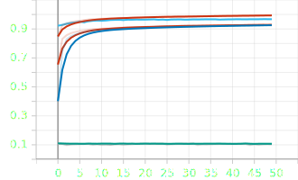
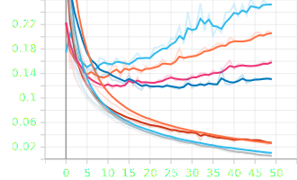
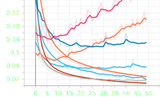
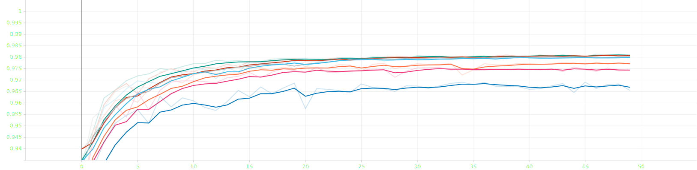
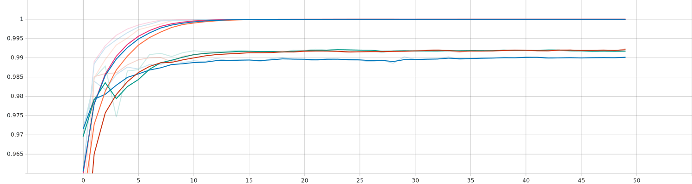
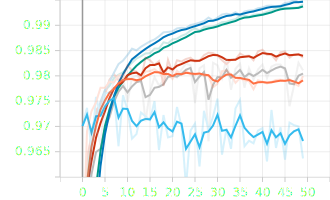
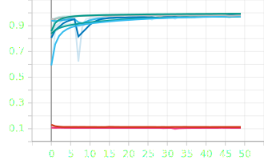
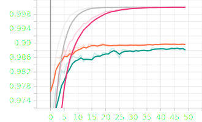

# Här är mina resultat hittils:
7/
A/ Ja, vid höga inlärnings hastigheter så tappar agenten precisionen på gissningarna.
 

B/ sänker man träningsbrancherna så går det snabbare att träna per steg men den tappar också träffsäkerheten.

C/ convolutional modellen tar mycket längre tid att träna, detta beror på att den kör flera lager av samma data vilket tar längre tid men genererar ett bättre resultat.

D/ Det blir bättre resultat för convolutional modellen men tog nästan 4 minuter längre att köra. vi kan se skillnaden i snittet på antal rätt siffror.
enligt våra tester är det samma skillnader för båda nätverken.

E/ Den blir alltid bättre men efter 512 blir förbättringrna minimala men det krävs mycket mer resurser för att köra processen.

F/ Desto högre kernal och strides agenten hade så blev den sämmre och sämmre på att gissa rätt siffror.
, (16,16 2,2), (24,24 4,4)")

G/ Moved data blir bättre med djupare nätverk och fler lager, däremot avtar nyttan ganska kraftigt om man adderar yttligarre lager
och så blir rotated data sämmre.

8/
Eget test 1,2,3/
enligt test i uppgift 7 så kom vi fram till att vårt bästa lr va blev 0.37 så därför fortsätter vi med det i även dessa test, Vi provade att kombinera dett amed att ändra batch sizen där vi använde 256 som basvärde och provade där efter att byta till  både 512 och 16 där 16 blev ganaska mycket sämmre än basvärdet och 512 vart lite bättre.

Eget Test 4,5,6,7/
Vi bestämde oss för att testa vidare på lr raten för att avgöra om det är en bästa vi har hittils, vi provade värdena 0.01, 0.37, 0.7

Eget Test 8.9/
Efter att ha hittat de väreden vi tror är bäst så startade tog vi och testade det nya värdena i två olika layers Förts testade vi en med batchsize 256 och en med 512 i det här fallet var 512 bättre på moved data medans 256 var bättre på rotated data

I den här filen ska ni beskriva:
- Era experiment
- Era slutsatser

## Glöm inte!

Glöm inte att ha med figurer:

